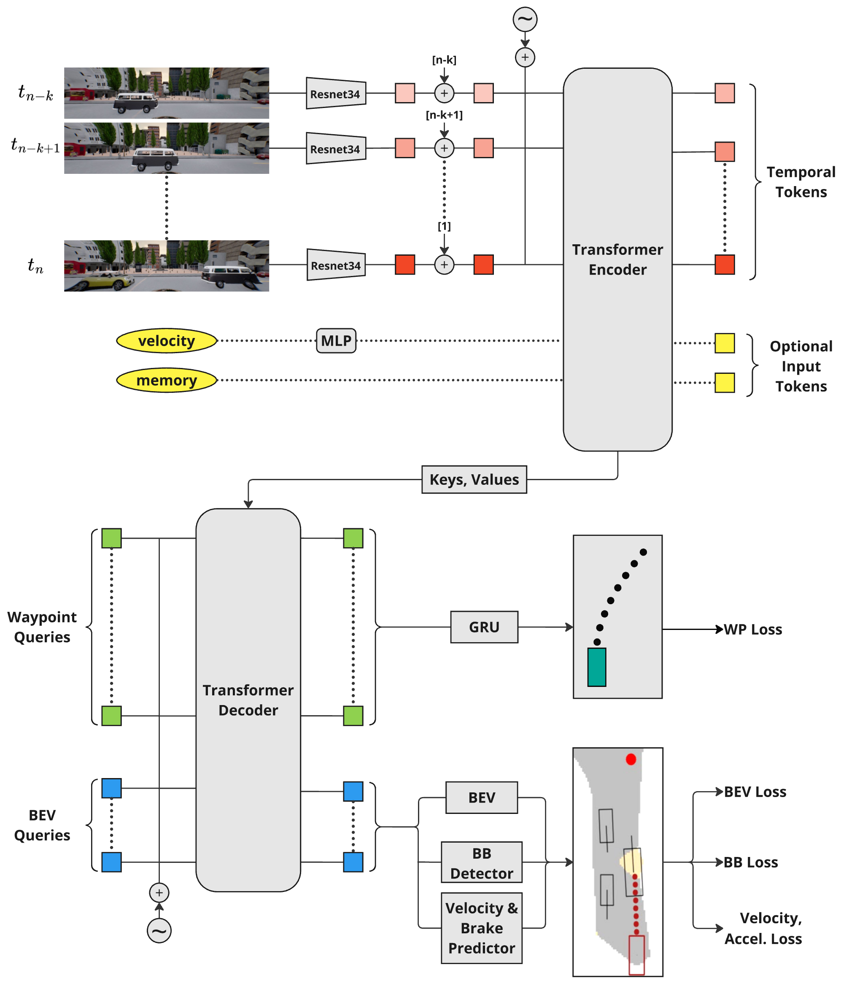

> **Temporal Imitation Learning in End-to-End Driving Models**  
> Maximilian Hilbert, [Bernhard Jaeger](https://kait0.github.io/), [Andreas Geiger](https://www.cvlibs.net/)  
> 
> 
> This repo contains the code for the master's thesis **Temporal Imitation Learning in End-to-End Driving Models**, which is based on the Carla Garage Repository of our research group https://github.com/autonomousvision/carla_garage by [Bernhard Jaeger](https://kait0.github.io/)

## Contents

1. [Method](#method)
2. [Performance](#performance)
3. [Copycat Metric](#cc)
4. [Dataset](#dataset)
4. [Data generation](#data-generation)
5. [Training](#training)
6. [Additional Documenation](#additional-documentation)
7. [Citation](#citation)

## Method

The method implemented in this code uses a transformer encoder-decoder structure to learn temporal information from previous frames during training in an end-to-end training scheme. The study is based on the well-known copycat problem, which occurs in end-to-end driving with temporal information.

Due to the high temporal correlation of consecutive frames, the model finds a shortcut during training, leading to extraction of its ego-trajectory and effectively copying its own previous actions. At inference in closed-loop simulation, this leads to catastrophic failure cases.

This study reproduces and modernises known approaches for tackling this problem as well as improve them by using a modern architecture (TimeFuser) and BEV+Velocity prediction auxilary tasks.

  

## Performance
The Method in this code achieves State of the Art Performance on the Carla NoCrash Benchmark
<table>
    <thead>
        <tr>
            <th>Baseline</th>
            <th>BEV aux. loss.</th>
            <th>Reproduced Success in %</th>
            <th>TimeFuser Success in %</th>
        </tr>
    </thead>
    <tbody>
        <tr>
            <td rowspan="2">BCSO [1]</td>
            <td>✘</td>
            <td>37 ± 13</td>
            <td>58.67 ± 4.58</td>
        </tr>
        <tr>
            <td>✔</td>
            <td>-</td>
            <td>70.5 ± 6.02</td>
        </tr>
        <tr>
            <td rowspan="2">BCOH [2]</td>
            <td>✘</td>
            <td>39 ± 4</td>
            <td>32.67 ± 7.62</td>
        </tr>
        <tr>
            <td>✔</td>
            <td>-</td>
            <td>34.67 ± 4.0</td>
        </tr>
        <tr>
            <td rowspan="2">ARP [3]</td>
            <td>✘</td>
            <td>49 ± 9</td>
            <td>55.56 ± 12.03</td>
        </tr>
        <tr>
            <td>✔</td>
            <td>-</td>
            <td>76.0 ± 6.32</td>
        </tr>
        <tr>
            <td>Rails</td>
            <td>✘</td>
            <td>74</td>
            <td>-</td>
        </tr>
    </tbody>
</table>

[1] Codevilla, F., Santana, E., Lopez, A., & Gaidon, A. (2019). Exploring the limitations of behavior cloning for autonomous driving

[2] Wen, C., Lin, J., Qian, J., Gao, Y., & Jayaraman, D. (2021). Keyframe-Focused Visual Imitation Learning

[3] Chuang, C.-C., Yang, D., Wen, C., & Gao, Y. (2022). Resolving Copycat Problems in Visual Imitation Learning via Residual Action Prediction

## Copycat Metric (Open-Loop)
The following video showcases the copycat problem, by detection two consecutive repeating actions while the producing a high loss.
[Copycat Metric Video](https://youtu.be/wt6SxrGrTvE?si=O63vYZzIe6PPFffM)
## Details
coming soon

## Acknowledgements
Open source code like this is build on the shoulders of many other open source repositories.
In particularly we would like to thank the following repositories for their contributions:
* [simple_bev](https://github.com/aharley/simple_bev)
* [transfuser](https://github.com/autonomousvision/transfuser)
* [interfuser](https://github.com/opendilab/InterFuser)
* [mmdet](https://github.com/open-mmlab/mmdetection)
* [roach](https://github.com/zhejz/carla-roach/)
* [plant](https://github.com/autonomousvision/plant)
* [king](https://github.com/autonomousvision/king)
* [wor](https://github.com/dotchen/WorldOnRails)
* [tcp](https://github.com/OpenDriveLab/TCP)
* [lbc](https://github.com/dotchen/LearningByCheating)

We also thank the creators of the numerous pip libraries we use. Complex projects like this would not be feasible without your contribution.
